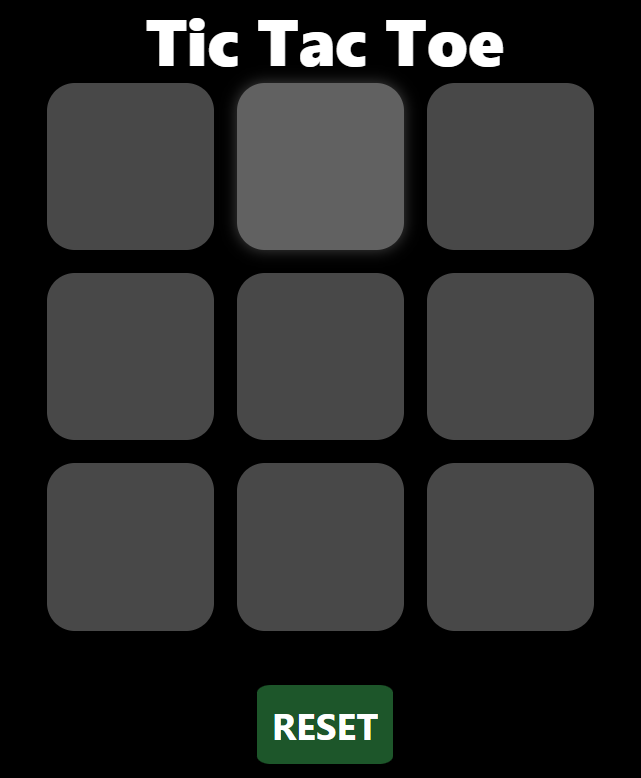

# 🎮 Tic Tac Toe

A simple and interactive **Tic Tac Toe game** built using **HTML, CSS, and JavaScript**. This is a classic two-player game where users take turns playing as **X** and **O** on a 3x3 grid. The game detects wins, disables played cells, and offers options to reset or start a new game.

---

## 📷 Screenshots

<p align="center">
  
</p>

<p align="center">
  <strong>Tic-Tac-Toe - Dark Themed UI</strong>
</p>

---

## 🧠 Features

- ✅ Two-player game (X and O)
- 🧠 Automatic win detection based on all 8 possible patterns
- 🚫 Disables clicked boxes to avoid re-clicks
- 🎉 Displays a winning message and highlights the winner
- 🔄 New Game & Reset buttons to start over
- 💅 Responsive and minimal dark-themed UI

---

## 🧩 Tech Stack

- **HTML5** – For page structure
- **CSS3** – For styling, layout, and responsiveness
- **JavaScript (Vanilla)** – For all game logic and interactivity

---

## 📁 File Overview

| File        | Purpose                                                    |
|-------------|------------------------------------------------------------|
| `index.html` | The main HTML layout for the game                         |
| `style.css`  | Dark mode styles and UI layout using CSS Grid and Flexbox |
| `index.js`   | Handles game turns, winner detection, and reset logic     |
| `tic-tic.png`| Game screenshot used in the README                        |

---

## 🖥️ How to Run Locally

1. Clone the repository:
   ```bash
   git clone https://github.com/your-username/tic-tac-toe.git
   cd tic-tac-toe
